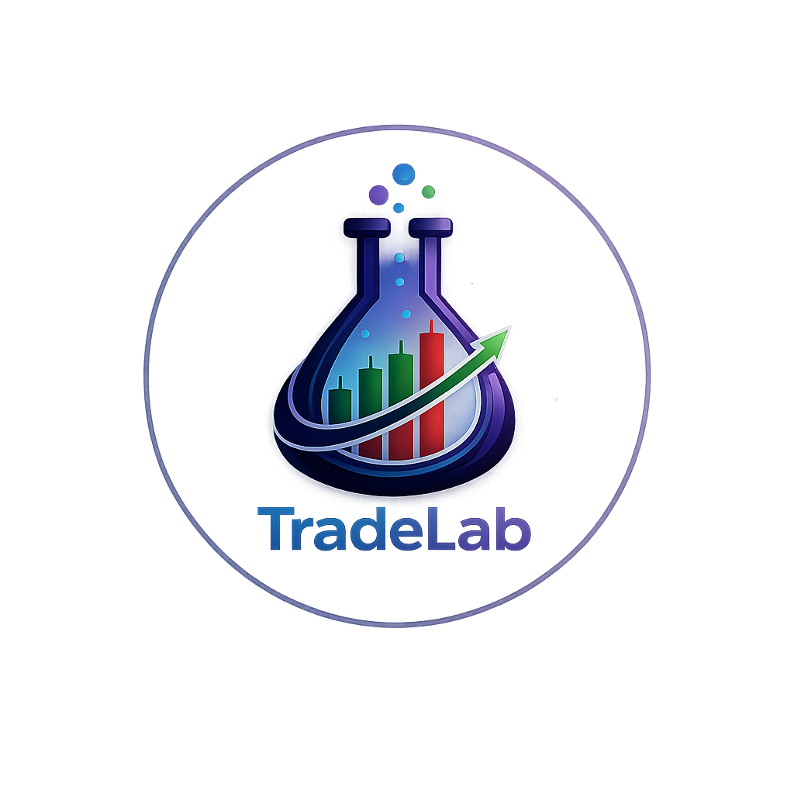

# TradeLab



TradeLab — это демонстрационный интерфейс для платформы исследования, запуска и сравнения алгоритмических торговых стратегий. Проект реализован как фронтенд на Next.js и сейчас работает на локальных мок-данных без реального бэкенда.

Основная идея интерфейса — строить UX вокруг проекта и его запусков: от загрузки файлов стратегии и выбора датасета до просмотра результатов, артефактов и сравнения нескольких прогонов.

## Что есть в проекте

- русифицированный интерфейс с минималистичным shell;
- рабочие экраны `workspace`, `desktop`, `data`, `backtests`, `runs/[id]`, `compare`;
- состояние запусков в клиентском store;
- демонстрационные таблицы, графики и панели на мок-данных;
- архив с исходным scaffold-проектом, вынесенный из активной структуры.

## Технологии

- Next.js 16
- React 18
- TypeScript
- Tailwind CSS
- Radix UI
- Recharts

## Быстрый старт

Требования:

- Node.js 20+
- npm 10+

Установка и запуск:

```bash
npm install
npm run dev
```

Приложение будет доступно по адресу `http://localhost:3000`.

Сборка production-версии:

```bash
npm run build
npm run start
```

Проверка типов:

```bash
npx tsc --noEmit
```

## Доступные команды

- `npm run dev` — локальный dev-сервер Next.js
- `npm run build` — production-сборка
- `npm run start` — запуск production-сборки
- `npm run lint` — линтинг проекта

## Структура проекта

```text
.
├── app/                    # маршруты App Router
├── archive/                # вынесенные из активной разработки архивы
├── components/
│   ├── shell/              # каркас приложения: sidebar, topbar, shell
│   ├── shared/             # общие составные компоненты и состояния
│   └── ui/                 # базовые UI-примитивы
├── docs/                   # проектная документация
├── features/
│   └── runs/               # доменная логика запусков, таблицы, графики, store
├── lib/
│   ├── demo-data/          # мок-данные и фабрики для демо-сценариев
│   ├── types/              # доменные типы
│   ├── ui-text.ts          # единые текстовые маппинги UI
│   └── utils.ts            # общие утилиты
├── public/                 # статические ассеты
└── styles/                 # дизайн-токены и общие стили
```

## Роли директорий

### `app/`

Здесь лежат страницы Next.js App Router и корневые провайдеры. Маршруты максимально тонкие: они собирают экран из feature- и shared-компонентов, но не хранят внутри себя лишнюю инфраструктуру.

### `components/shell/`

Каркас интерфейса:

- `app-shell.tsx` — общий layout приложения;
- `sidebar.tsx` — левая навигация;
- `topbar.tsx` — верхняя панель;
- `logo-placeholder.tsx` — блок логотипа.

### `components/shared/`

Переиспользуемые составные компоненты, которые не относятся к одному конкретному домену:

- карточка графика;
- empty/loading состояния;
- client-only обертка;
- page header и surface-контейнеры.

### `components/ui/`

Низкоуровневые UI-примитивы. Это слой, из которого собираются все остальные экраны и компоненты.

### `features/runs/`

Главная доменная зона проекта:

- `components/` — карточки метрик, хедер запуска, таблицы, индикаторы;
- `charts/` — графики equity, drawdown, histogram и preview;
- `store/` — клиентское состояние запусков.

### `lib/demo-data/`

Вся демонстрационная информация лежит отдельно от UI:

- проекты;
- версии датасетов;
- запуски;
- трейды;
- логи;
- фабрики тестовых запусков.

Это позволяет в будущем заменить мок-источники на API без переписывания всего интерфейса.

### `docs/`

Внутренняя документация проекта. Сейчас здесь хранится [дизайн-спецификация](./docs/DESIGN.md).

### `archive/`

Архивные материалы, не участвующие в активной сборке. В `archive/tradelab_app/` перенесен старый scaffold, чтобы он не мешал текущей структуре и не путал навигацию по репозиторию.

## Архитектурные принципы

- Маршруты в `app/` остаются тонкими и композиционными.
- Доменные элементы собираются в `features/`, а не размазываются по всему проекту.
- Общие композиционные куски лежат в `components/shared/`.
- Низкоуровневые UI-примитивы живут отдельно в `components/ui/`.
- Демо-данные изолированы от представления в `lib/demo-data/`.
- Повторяющиеся пользовательские подписи и статусы централизованы в `lib/ui-text.ts`.

## Основные экраны

- `/workspace` — раздел «Главное» с обзором проектов, датасетов и запусков;
- `/desktop` — «Рабочий стол» выбранного проекта с контекстом, графиками, будущими манипуляциями и точками входа;
- `/data` — источники данных, pipeline и версии датасетов;
- `/backtests` — очередь и список запусков;
- `/runs/[id]` — детальная карточка конкретного запуска;
- `/compare` — сравнение нескольких запусков;
- `/settings` — заглушка под системные настройки;
- `/research` и `/deploy` — заготовки под будущие разделы.

## Как расширять проект

Если добавляется новая доменная область:

1. Создать новую папку в `features/`.
2. Держать компонентную логику рядом с доменом.
3. Оставлять в `app/` только маршрутизацию и композицию экрана.
4. Выносить мок-данные или адаптеры данных из страницы в `lib/`.

Если добавляется новый общий визуальный блок:

1. Поместить низкоуровневую основу в `components/ui/`, если это примитив.
2. Поместить составной, но недоменный компонент в `components/shared/`.
3. Не складывать новую логику обратно в старые плоские папки.

## Текущее состояние

Проект пока не подключен к реальному API и не содержит серверной модели данных. Это UI-прототип, который уже можно развивать в сторону полноценного терминала для загрузки файлов стратегий, исследования и воспроизводимого запуска торговых сценариев.
