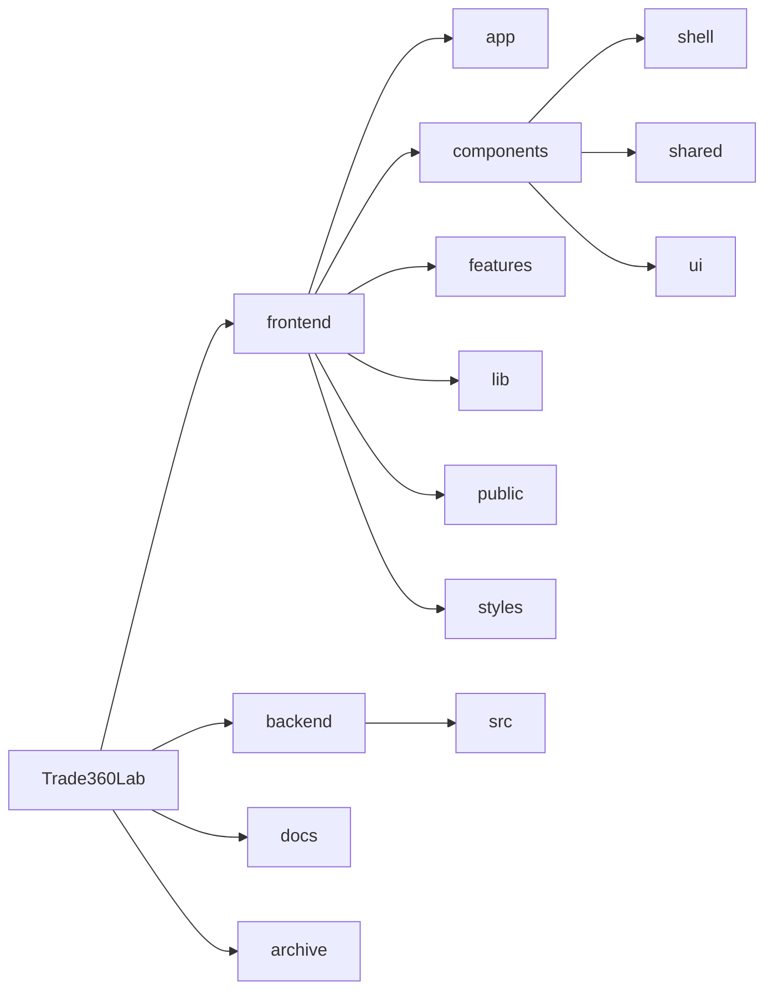

<p align="center">
  
</p>
<h1 align="center">Trade360Lab</h1>

Trade360Lab — это монорепозиторий платформы для исследования, подготовки данных, запуска и сравнения торговых сценариев. Основной интерфейс находится во `frontend` и построен на Next.js: в нём собраны рабочее пространство, экран данных, бэктесты, карточки запусков и сравнение результатов. Папка `backend` содержит серверный scaffold для дальнейшего развития API и служебной логики. Дополнительно в репозитории есть `docs` с проектной документацией и `archive` с архивными материалами, которые не участвуют в активной сборке.

## Mermaid-схема



## Структура проекта

```text
.
|-- frontend/
|   |-- app/          # маршруты App Router
|   |-- components/   # shell, shared-компоненты и UI-примитивы
|   |-- features/     # доменная логика
|   |-- lib/          # демо-данные, типы и утилиты
|   |-- public/       # статические ассеты
|   `-- styles/       # дизайн-токены и глобальные стили
|-- backend/
|   `-- src/          # backend scaffold
|-- docs/             # проектная документация
`-- archive/          # архивные материалы
```

## Стек фронтенда

- Next.js 16
- React 18
- TypeScript
- Tailwind CSS
- Radix UI
- Recharts

## Основные маршруты фронтенда

- `/workspace` — обзорный дашборд
- `/desktop` — рабочее пространство проекта
- `/data` — данные и импорт
- `/backtests` — очередь и запуск бэктестов
- `/runs/[id]` — детальная карточка запуска
- `/compare` — сравнение нескольких запусков
- `/research`, `/deploy`, `/settings` — заготовки под отдельные разделы

## Быстрый старт

Требования:

- Node.js 20+
- npm 10+

Установка зависимостей:

```bash
npm run install:all
```

Запуск фронтенда:

```bash
npm run dev
```

Фронтенд будет доступен по адресу `http://localhost:3000`.

Запуск backend:

```bash
npm run dev:backend
```

Backend будет доступен по адресу `http://localhost:4000` и отдаёт `GET /health`.

## Полезные команды

- `npm run dev` — запустить фронтенд
- `npm run build` — собрать фронтенд
- `npm run start` — запустить production-сборку фронтенда
- `npm run typecheck` — проверить типы во фронтенде
- `npm run lint` — запустить линтинг фронтенда
- `npm run dev:frontend` — явно запустить фронтенд
- `npm run dev:backend` — запустить backend
- `npm run install:frontend` — установить зависимости фронтенда
- `npm run install:backend` — установить зависимости backend
- `npm run install:all` — установить все зависимости
