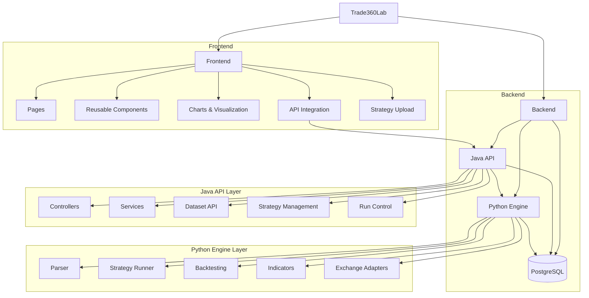
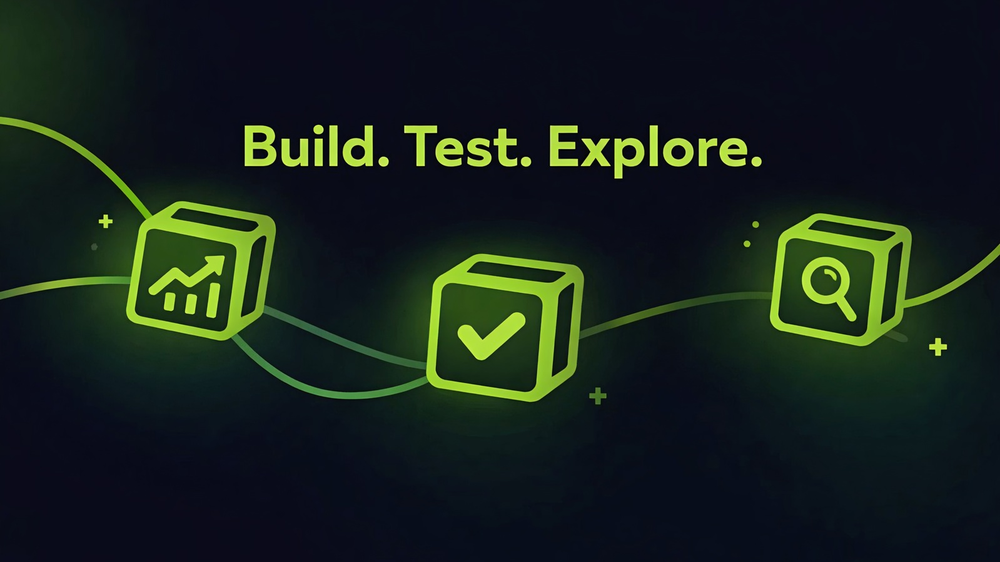

<p align="center">
  
</p>
<h1 align="center">Trade360Lab</h1>

Trade360Lab — это монорепозиторий платформы для исследования, подготовки данных, запуска и сравнения торговых сценариев. Основной интерфейс находится во `frontend` и построен на Next.js: в нём собраны рабочее пространство, экран данных, бэктесты, карточки запусков и сравнение результатов. Папка `backend` содержит Java API и Python parser/backtesting сервис. В репозитории также есть `docs` с проектной документацией.

<h2 align="center">Архитектура</h2>



<h2 align="center">Текущая структура проекта</h2>

```text
Trade360Lab/
|-- frontend/               # Next.js приложение (UI + API proxy)
|   |-- app/
|   |-- components/
|   |-- features/
|   |-- lib/
|   `-- public/
|-- backend/
|   |-- java/               # Spring Boot API
|   `-- python/             # FastAPI parser/import service
|-- docs/                   # Проектная документация
|-- .github/workflows/      # CI пайплайн
`-- docker-compose.yml      # Оркестрация всего стека
```

<h2 align="center">Быстрый старт</h2>

<h3 align="center">Вариант A: весь стек в Docker (рекомендуется)</h3>

```bash
docker compose up --build
```

Сервисы:
- Frontend: `http://localhost:3000` (или `${FRONTEND_HOST_PORT}`)
- Java API: `http://localhost:18080` (или `${JAVA_API_HOST_PORT}`)
- Python parser: `http://localhost:18000` (или `${PYTHON_PARSER_HOST_PORT}`)
- PostgreSQL: `localhost:55432` (или `${POSTGRES_HOST_PORT}`, если переопределён)

<h3 align="center">Вариант B: локальная разработка</h3>

1. Фронтенд
```bash
cd frontend
npm install
npm run dev
```

2. Python parser
```bash
cd backend/python
python -m venv .venv
source .venv/bin/activate
pip install -r requirements.txt
uvicorn parser.main:app --host 0.0.0.0 --port 8000
```

3. Java API
```bash
cd backend/java
mvn spring-boot:run
```

<h2 align="center">Подробная документация</h2>

- Фронтенд: [`frontend/README.md`](./frontend/README.md)
- Обзор бэкенда: [`backend/README.md`](./backend/README.md)
- Java API: [`backend/java/README.md`](./backend/java/README.md)
- Python parser: [`backend/python/README.md`](./backend/python/README.md)
- Release checklist: [`docs/release-checklist.md`](./docs/release-checklist.md)

--- 
<p align="center">
  
</p>

---

<p align="center">
  Copyright (C) 2026 AlexToday111 <br/>
  This project is licensed under the GNU General Public License v3.0
</p>
