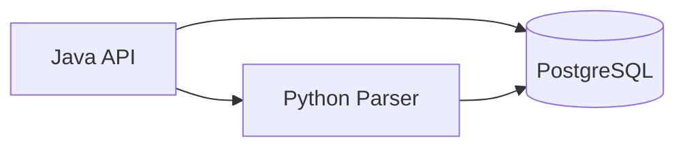

<h1 align="center">Trade360Lab Backend</h1>

<p align="center">
  Бэкенд разделен на два сервиса: Java API и Python parser.
</p>

<h2 align="center">Архитектура бэкенда</h2>



<h2 align="center">Зоны ответственности</h2>

<h3 align="center">Java API (`backend/java`)</h3>

- REST API для:
  - датасетов (`/api/datasets`)
  - свечей (`/api/candles`)
  - запуска импорта (`/api/imports/candles`)
  - запуска execution runs (`/api/runs`)
  - health (`/api/health`, `/api/python/health`)
- Работа с PostgreSQL (датасеты, чтение свечей)
- Orchestration/control plane для запуска run и сохранения snapshots/results
- Интеграция с Python parser по HTTP

<h3 align="center">Python parser (`backend/python`)</h3>

- Импорт свечей с бирж (сейчас Binance)
- Нормализация и upsert свечей в PostgreSQL
- Internal execution plane для strategy run
- Внутренние endpoints:
  - `GET /health`
  - `POST /internal/import/candles`
  - `POST /internal/runs/execute`

<h2 align="center">Быстрый старт</h2>

<h3 align="center">Docker Compose (рекомендуется)</h3>

```bash
docker compose up --build
```

<h3 align="center">Локально</h3>

1. Поднять PostgreSQL
2. Запустить Python parser (`backend/python`)
3. Запустить Java API (`backend/java`)

<h2 align="center">Подробные README</h2>

- Java: [`java/README.md`](./java/README.md)
- Python: [`python/README.md`](./python/README.md)
